# blog

## Overview

This is a front and back-end separation blog system built by Vue3 and NodeJS.

The blog mainly provides user article overview, article management, article category management, and authentication.

## Quick Start

In the root of client, run `npm install`. 
And then run `npm run dev`.

In the root of server, run `npm install`. 
And then run `node .\app.js`.

Open the browser and enter `http://127.0.0.1:5173/`.

There you see the page below.

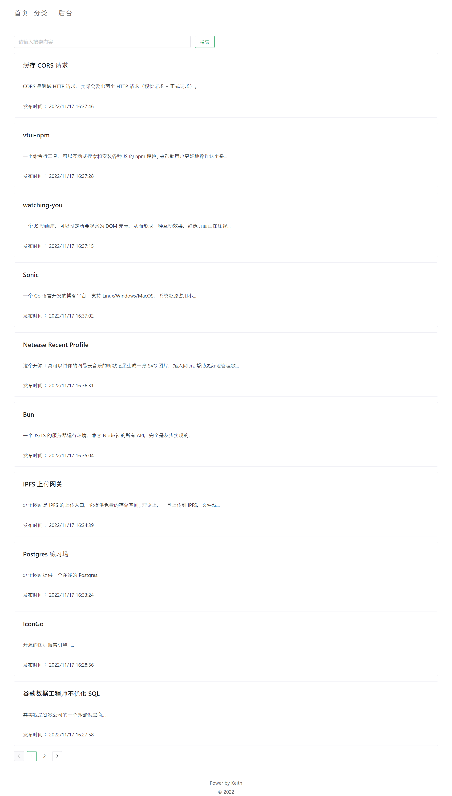

## Description

### Home

List all the articles the blog has. The user can filter articles by using the key word searching, that is the search bar below the header(搜索) or by using the category sorting function of the header (分类).

The key word searching is to search the key word containing in the title or content.

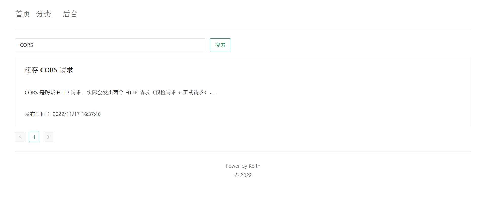

The category sorting function is to search the articles by category.

And you can even search articles combined using key word searching and category sorting.

※Category is defined in the category management.

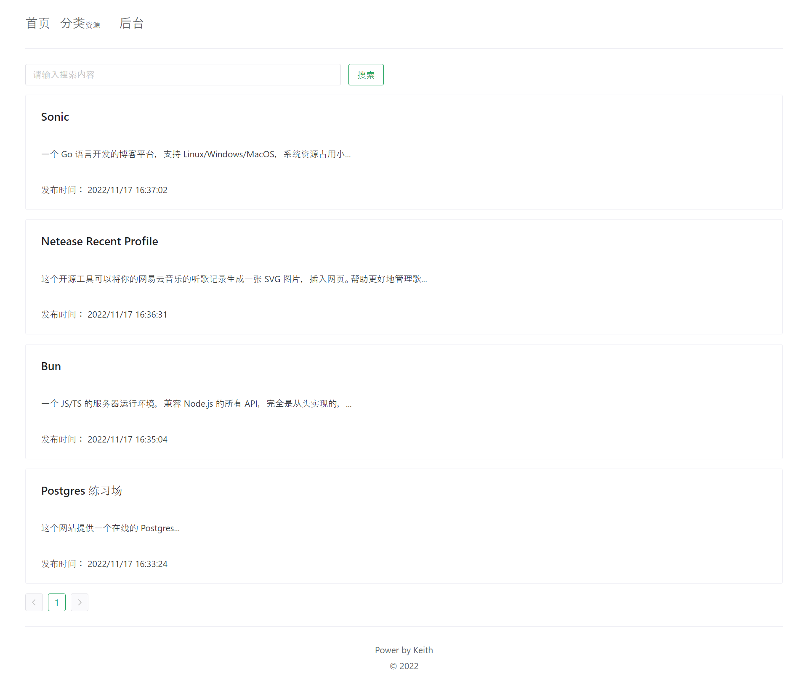

The articles list only provides title and limited contents of the articles.

If you want to see the detail of the articles, you can click the article and enter the detail page.

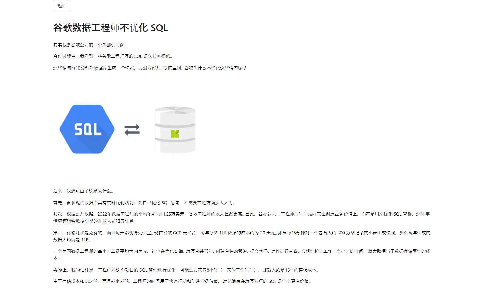

### Login

The authentication function is implemented to prevent illegal modification of the articles and categories.

If the user want to add or edit the articles or categories, he/she should login first.

Otherwise, the user cannot make any changes to the data.

#### Login page

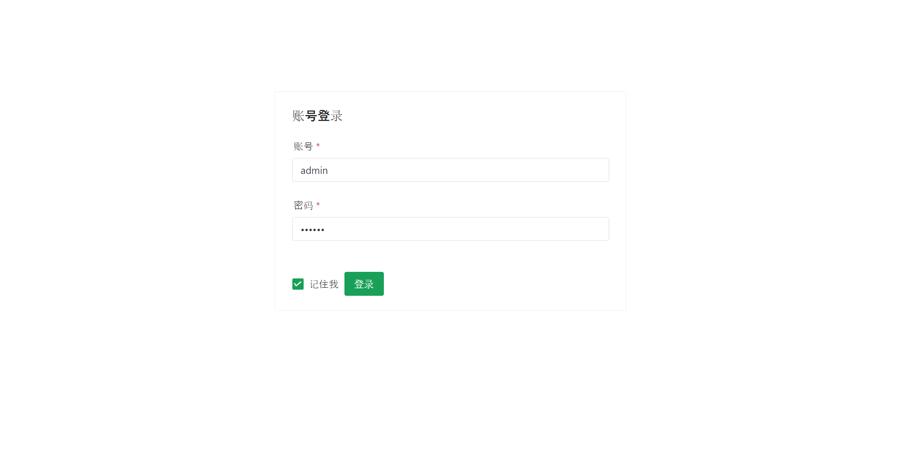

#### Illegal Access

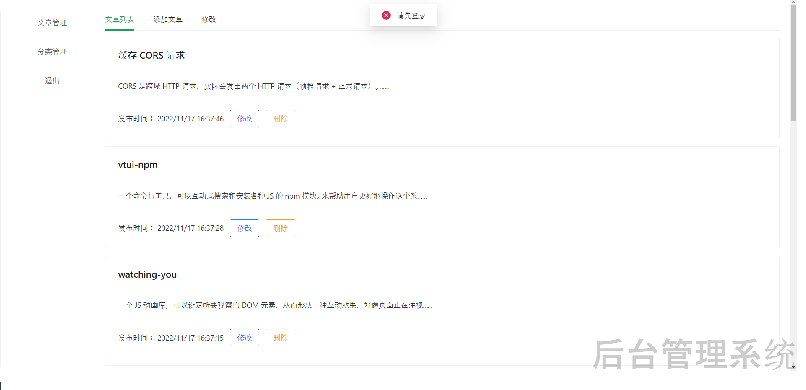

### Article Management

You can add, edit, and delete the articles and categories in the Backoffice.

Any operation without authentication would be prohibited.

#### Article List
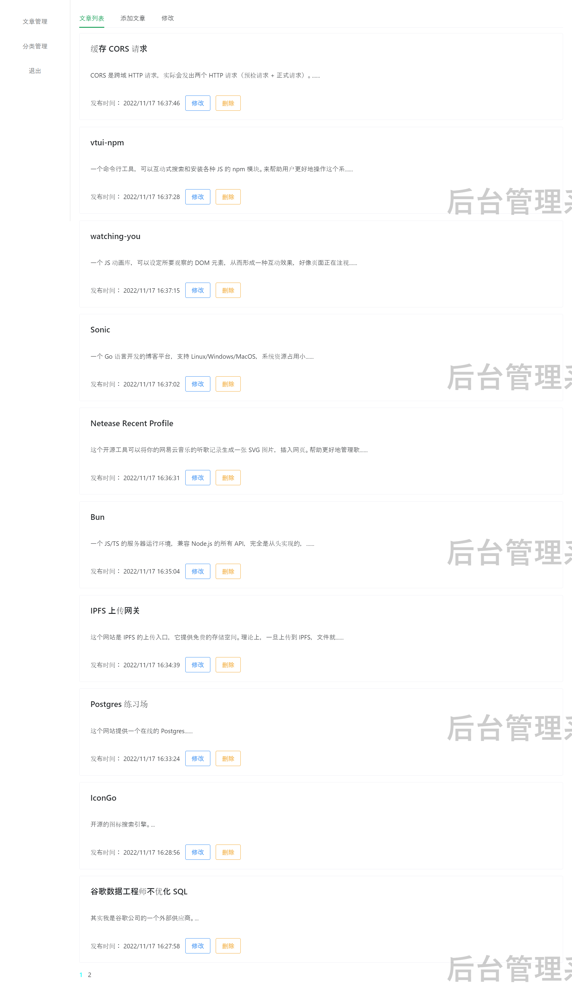

#### Article Addition
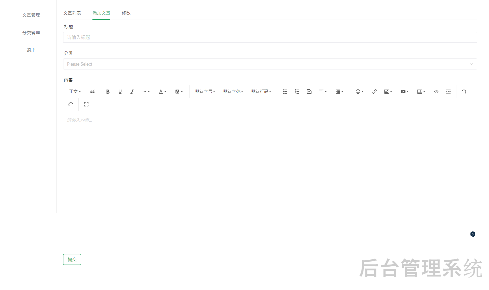

#### Article modification
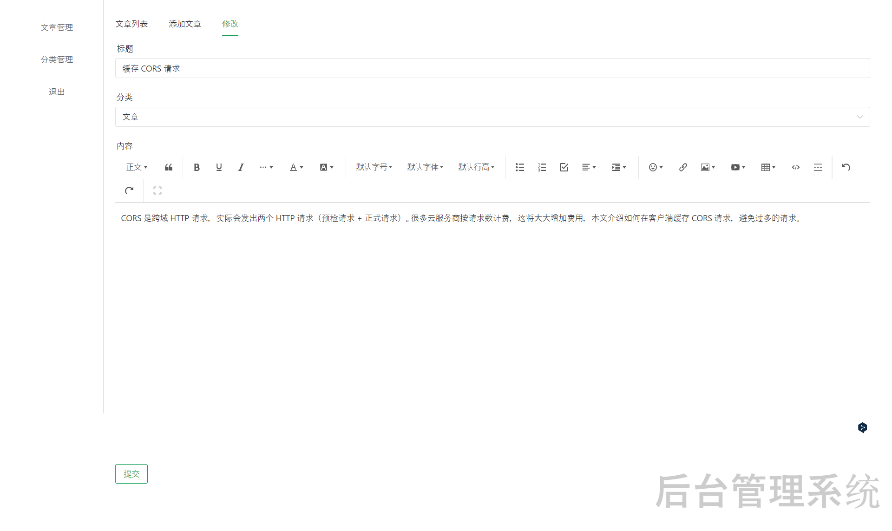

#### Article Deletion
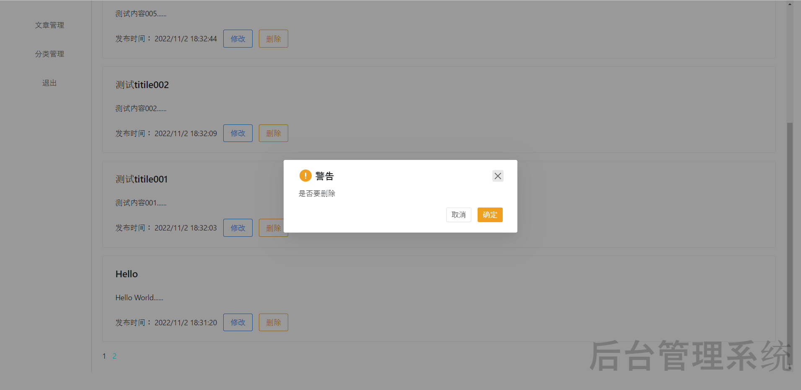

#### Category List
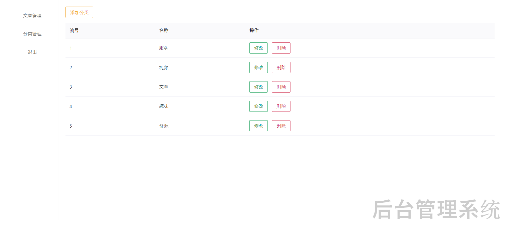

#### Category Addition

#### Category modification
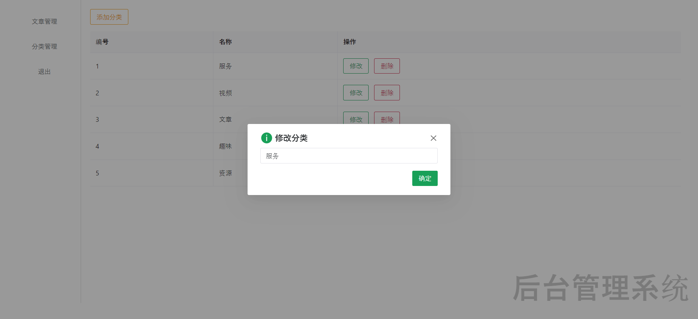

#### Category Deletion
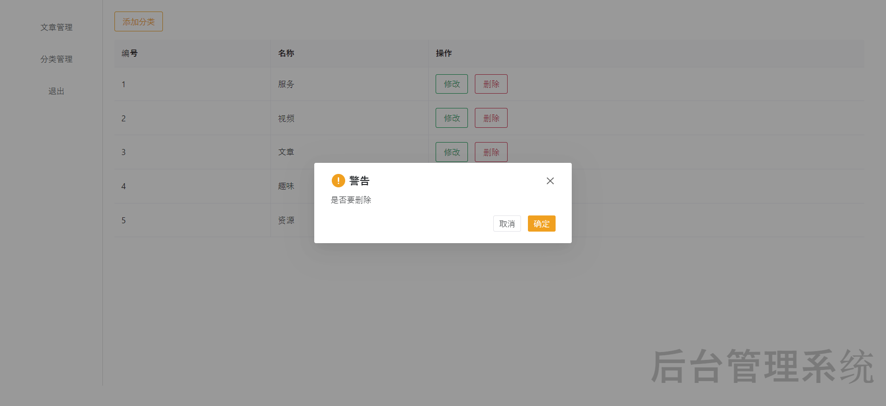

## Technology Stack
- Front
  - vue3
  - wangeditor (editor)
  - axios
  - pinia (status management)
  - sass
- Backend
  - express
  - multer (file upload)
  - uuid (token generator)
- Database
  - sqlite
